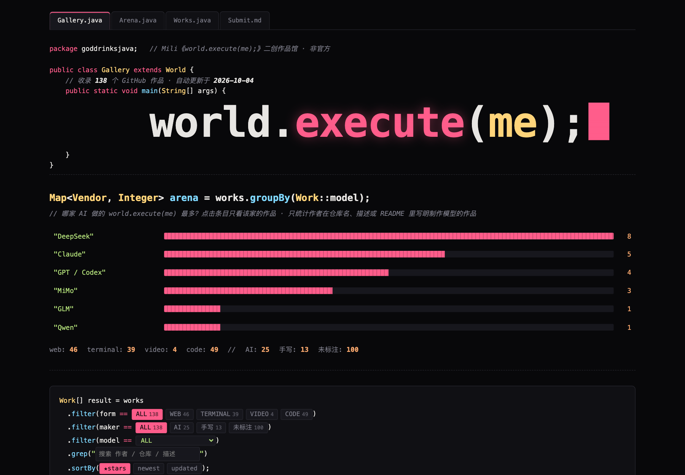

# Awesome world.execute(me); [](https://awesome.re)

Mili《world.execute(me);》的非官方同人作品馆，收录 GitHub 上的网页、终端 ASCII、代码渲染 PV 与各种语言的代码实现。

<p align="center">
  <a href="https://beiwater.github.io/awesome-world-execute-me/"></a>
</p>

[在线浏览作品馆](https://beiwater.github.io/awesome-world-execute-me/)。

- AI 擂台：按 Claude / GPT / DeepSeek / Qwen / GLM / MiMo 等模型统计，看哪家做的最多，一键筛选。
- 可分享的筛选链接：例如 [`?model=DeepSeek`](https://beiwater.github.io/awesome-world-execute-me/?model=DeepSeek)、[`?form=terminal`](https://beiwater.github.io/awesome-world-execute-me/?form=terminal)。
- 自动更新：GitHub Actions 每 6 小时搜索一次新作品，刷新 stars、页面和下面的列表。

## Contents

- [精选](#精选)
  - [在线直接看](#在线直接看)
  - [成片视频](#成片视频)
  - [克隆后本地打开](#克隆后本地打开)
- [全部作品](#全部作品)
  - [网页 Web](#网页-web)
  - [终端 ASCII Terminal](#终端-ascii-terminal)
  - [代码渲染视频 PV Video](#代码渲染视频-pv-video)
  - [代码实现 Code](#代码实现-code)
- [本地运行](#本地运行)

## 精选

人工挑选：每个作品都实际播放过，能跑通、自带歌曲音频、画面与歌词呼应。评审标准见文末贡献指南。

### 在线直接看

- [LingXuanYin/world.execute-me](https://github.com/LingXuanYin/world.execute-me) - 粉青 ASCII 像素窗口与电路背景，逐步过渡为彩色的绿发天使角色，以歌曲音频作为画面时钟. [在线观看](https://lingxuanyin.github.io/world.execute-me/).
- [Miks221/world-execute-me](https://github.com/Miks221/world-execute-me) - 满屏绿字 CRT 终端，歌词逐行滚动，穿插 Java 对象面板、巨型关键词和 BIOS 状态条，以 kernel panic 收场. [在线观看](https://miks221.github.io/world-execute-me/).
- [AuthourAkson/DeepSeekFlash4.1-World-Exectue-ME](https://github.com/AuthourAkson/DeepSeekFlash4.1-World-Exectue-ME) - 点阵、同心环、条件菱形和 MIDI 音符轨组成的终端式 MV，副歌构图干净丰富. AI 模型：DeepSeek V4.1 Flash；[在线观看](https://authourakson.github.io/DeepSeekFlash4.1-World-Exectue-ME/).
- [zmrlft/world-execute-me-idea](https://github.com/zmrlft/world-execute-me-idea) - 拟真 IntelliJ IDEA 界面，Java 代码随歌词推进，底部终端输出圆周、正弦波等运行日志. [在线观看](https://zmrlft.github.io/world-execute-me-idea/).
- [user-lqt/world-execute-me](https://github.com/user-lqt/world-execute-me) - 86 句歌词对应 86 段联想 Java 代码，左侧歌词、右侧代码逐句打出. [在线观看](https://user-lqt.github.io/world-execute-me/).

### 成片视频

- [MisakaZentai/world-execute-me-dsh-pv](https://github.com/MisakaZentai/world-execute-me-dsh-pv) - 左侧 DeepSeek 聊天窗口逐步演变，右侧是蓝色 ASCII 鲸鱼和训练状态. AI 模型：Claude Opus, GPT-6 Astra；[B站](https://www.bilibili.com/video/BV1xCai6aE9g).
- [HFASLTO117/Videos_by_GPT6](https://github.com/HFASLTO117/Videos_by_GPT6) - 青色与暖白粒子组成双球和空间线框，大字关键词配双语字幕. AI 模型：GPT-6 Ultra；[1080p 成片](https://github.com/HFASLTO117/Videos_by_GPT6/releases/download/v1.0.0/world-execute-me-mv.mp4).
- [DavidW-12239/world.execute-me-](https://github.com/DavidW-12239/world.execute-me-) - 蓝发黑裙人物、月轮和复古电脑通知，配中英打字歌词. [1080p 成片](https://github.com/DavidW-12239/world.execute-me-/blob/HEAD/mv/video/world_execute_me_MV_1080p.mp4).
- [yizhiclc/models-acts](https://github.com/yizhiclc/models-acts) - 黑金 ASCII 几何空间、me/you 方框和状态代码，配双语字幕的增强版 MV. [成片](https://github.com/yizhiclc/models-acts/releases/download/archive-2026-10-01/23-world-execute-enhanced-mv.mp4).

### 克隆后本地打开

没有在线演示，需克隆后在仓库目录运行 `python3 -m http.server` 再用浏览器打开，直接双击 HTML 可能加载不了音频。

- [Sy2RK/DeepSeek-V4-1-Flash-world.execute-me-](https://github.com/Sy2RK/DeepSeek-V4-1-Flash-world.execute-me-) - CRT 扫描线、线框球体、正弦波和切线随歌词变换，底部逐句歌词. AI 模型：DeepSeek V4.1 Flash.
- [Galen563/world.execute-me](https://github.com/Galen563/world.execute-me) - 深色 CRT 扫描线、青色数学曲线和启动日志组成的实时 MV. AI 模型：DeepSeek V4.1 Flash.
- [ZioyeaMu/world.execute-me](https://github.com/ZioyeaMu/world.execute-me) - 星空背景下的发光心形、满意度柱状条和心电图，歌词以打字机方式出现. AI 模型：DeepSeek.
- [TianLSama/world.execute-me-](https://github.com/TianLSama/world.execute-me-) - 青色线框同心圆、网格和粒子构成的科幻空间，片头是大型打字标题；作品在仓库 `mv/` 目录.

## 全部作品

按形式分组、按 stars 排序，已入选精选的作品不再重复列出。本节由 `scripts/collect.py` 自动生成，请勿手改；自动收录不代表精选推荐。投稿与纠错见文末贡献指南。

<!-- works:start -->
### 网页 Web

- [UM7lab/world.execute.me.html](https://github.com/UM7lab/world.execute.me.html) - Song world.execute (me) ; Presented in HTML. ★ 262.
- [Cryolitia/artworks](https://github.com/Cryolitia/artworks) - Cryolitia's artworks. ★ 10；[在线 demo](https://cryolitia.github.io/artworks/)；[B站](https://www.bilibili.com/video/BV1RKNAePEKD).
- [Sy2RK/DeepSeek-V4-Flash-Vision-Exp-World.Execute-me-](https://github.com/Sy2RK/DeepSeek-V4-Flash-Vision-Exp-World.Execute-me-) - 网页形式的二创作品. ★ 5；AI 模型：DeepSeek V4 Flash.
- [bywenshu/world-execute-me](https://github.com/bywenshu/world-execute-me) - 网页形式的二创作品. ★ 4.
- [chaxiteamat/word-execute-me](https://github.com/chaxiteamat/word-execute-me) - 网页形式的二创作品. ★ 2.
- [1914018426/world.execute-me](https://github.com/1914018426/world.execute-me) - 前端艺术PV动画作品. ★ 2.
- [seasnakes/world.execute-me-wallpaper](https://github.com/seasnakes/world.execute-me-wallpaper) - B站《Opus5.5 一句话生成 world.execute(me); mv》配套网页源码. ★ 2；AI 模型：Claude Opus 5.5；[B站](https://www.bilibili.com/video/BV1RHhU63ESq).
- [zhengxiaoyao0716/world.execute](https://github.com/zhengxiaoyao0716/world.execute) - A funny code for \`world.execute (me) ;\`. ★ 1；制作：手写；[在线 demo](https://zhengxiaoyao0716.github.io/world.execute/).
- [phucngo2/world.execute.me.ts](https://github.com/phucngo2/world.execute.me.ts) - TypeScript implementation of Mili - world.execute(me);. ★ 1；制作：手写；[YouTube](https://www.youtube.com/watch?v=ESx_hy1n7HA).
- [bilixuesheng/world-execute-me](https://github.com/bilixuesheng/world-execute-me) - 网页形式的二创作品. ★ 1.
- [tsingxv/world-execute-me-animation](https://github.com/tsingxv/world-execute-me-animation) - World.execute(me); 网页动画：以 audio.currentTime 为唯一时间基准、每帧都是时间纯函数的 Canvas 运行时；卡点来自 MIDI、歌词时间轴来自 LRC、能量与闪光来自录音实测。仅代码，不含音频/曲谱/歌词. ★ 1.
- [eugenewang5425/world-execute-me](https://github.com/eugenewang5425/world-execute-me) - Code-rendered world.execute(me); MV — native 4K/60fps, Canvas 2D + WebGL2 + GLSL, storyboards and rendering pipeline. ★ 1；AI 模型：Codex.
- [monSteRhhe/world.execute.me-PV-codeScrolling-Demo](https://github.com/monSteRhhe/world.execute.me-PV-codeScrolling-Demo) - Js/jq写的world.execute(me); PV的代码滚动. ★ 0；制作：手写；[在线 demo](https://monsterhhe.github.io/world.execute.me-PV-codeScrolling-Demo/).
- [world-executed/world-executed.github.io](https://github.com/world-executed/world-executed.github.io) - 网页形式的二创作品. ★ 0；[在线 demo](https://world-executed.github.io/).
- [KaitoSugimura/World-Execute-Me](https://github.com/KaitoSugimura/World-Execute-Me) - 1 Hour project for fun. ★ 0；[在线 demo](https://kaitosugimura.github.io/World-Execute-Me/).
- [meowlok327/w.eme](https://github.com/meowlok327/w.eme) - 网页形式的二创作品. ★ 0；[在线 demo](https://meowlok327.github.io/w.eme/)；[YouTube](https://www.youtube.com/watch?v=ESx_hy1n7HA).
- [ljygyy/ljygyy.github.io](https://github.com/ljygyy/ljygyy.github.io) - 网页形式的二创作品. ★ 0；[在线 demo](https://ljygyy.github.io/).
- [Nsakrty/world.execute-me-](https://github.com/Nsakrty/world.execute-me-) - 网页形式的二创作品. ★ 0；[在线 demo](https://nsakrty.github.io/world.execute-me-/).
- [TheLambdaLich/world.execute.me](https://github.com/TheLambdaLich/world.execute.me) - World.execute.me 翻译. ★ 0；[在线 demo](https://thelambdalich.github.io/world.execute.me/).
- [lingyvxixi/world.execute-me-](https://github.com/lingyvxixi/world.execute-me-) - 网页形式的二创作品. ★ 0；[在线 demo](https://lingyvxixi.github.io/world.execute-me-/).
- [Luminet2023/world.execute.me](https://github.com/Luminet2023/world.execute.me) - Song world.execute (me) ; Presented in HTML. ★ 0.
- [001mzh/worldexecuteme.github.io](https://github.com/001mzh/worldexecuteme.github.io) - 网页形式的二创作品. ★ 0.
- [YQGHL/world\_execute\_me\_html](https://github.com/YQGHL/world_execute_me_html) - 网页形式的二创作品. ★ 0.
- [mehtmls/world.execute-me](https://github.com/mehtmls/world.execute-me) - 网页形式的二创作品. ★ 0.
- [luvchippy/worldexecuteme1](https://github.com/luvchippy/worldexecuteme1) - World-execute-me the music website. ★ 0；[在线 demo](https://luvchippy.github.io/worldexecuteme1/).
- [f0909172434/f0909172434](https://github.com/f0909172434/f0909172434) - Python and TypeScript tools for inspectable AI and mathematical research. Engineering and AI research portfolio by Chih-Kai Wang. ★ 0；AI 模型：未注明；[在线 demo](https://f0909172434.github.io/)；[YouTube](https://www.youtube.com/watch?v=kQH1PZRkn00).
- [siliconrecycle/frederica-execute-me](https://github.com/siliconrecycle/frederica-execute-me) - 网页形式的二创作品. ★ 0；[在线 demo](https://siliconrecycle.github.io/frederica-execute-me/).
- [Te-River/world.execute-me](https://github.com/Te-River/world.execute-me) - 基于Qwen3.8-Flash的Html仓库，用于表现world.execute(me)这首乐曲的视觉效果. ★ 0；AI 模型：Qwen3.8-Flash.
- [Zeromse/world-execute-ui-source](https://github.com/Zeromse/world-execute-ui-source) - 网页形式的二创作品. ★ 0.
- [maxlen727/world.execute-me](https://github.com/maxlen727/world.execute-me) - 🐱 大 world.execute(me) 时代已经来临，尝试使用 AI 制作一个它的 mv. ★ 0；AI 模型：未注明.
- [Tkingxiao/deepseek-world-execute-me-crt](https://github.com/Tkingxiao/deepseek-world-execute-me-crt) - 网页形式的二创作品. ★ 0；AI 模型：DeepSeek.
- [miociallo0721/world-execute-recreation](https://github.com/miociallo0721/world-execute-recreation) - Code-rendered world.execute(me) video recreation with reference media and cloud handoff. ★ 0.
- [CENSEDAXIS20025/world-execute-me-MV](https://github.com/CENSEDAXIS20025/world-execute-me-MV) - World.execute(me); - single-file HTML Canvas MV (Mili), generated with DeepSeek Harness. ★ 0；AI 模型：DeepSeek V4 Pro.
- [Aimer779/head-orbit](https://github.com/Aimer779/head-orbit) - 网页形式的二创作品. ★ 0.
- [Lxithral/world-execute-me-deepseek-whale-pv](https://github.com/Lxithral/world-execute-me-deepseek-whale-pv) - World.execute(me); · DeepSeek 鲸鱼娘版 — 浏览器音乐可视化 PV（非官方同人，CC BY-NC-SA 4.0）. ★ 0.
- [lingcat521/world-execute-me-live](https://github.com/lingcat521/world-execute-me-live) - Browser-native realtime port of the world.execute(me); TUI PV (WIP). ★ 0；[在线 demo](https://lingcat521.github.io/world-execute-me-live/).
- [beiwater/awesome-world-execute-me](https://github.com/beiwater/awesome-world-execute-me) - World.execute(gallery); — Mili《world.execute(me);》GitHub 二创作品馆：网页 / 终端 / PV / AI 擂台，自动更新. ★ 0；AI 模型：DeepSeek V4.1 Flash, GPT-6 Astra, GPT-6, GPT-6 Ultra；[在线 demo](https://beiwater.github.io/awesome-world-execute-me/)；[B站](https://www.bilibili.com/video/BV1xCai6aE9g)；[YouTube](https://www.youtube.com/watch?v=ESx_hy1n7HA).
- [Anontokyo-Mygo/Kimi-K3-opus5-World.execute-me-](https://github.com/Anontokyo-Mygo/Kimi-K3-opus5-World.execute-me-) - 网页形式的二创作品. ★ 0；AI 模型：Kimi K3, Claude Opus 5；[在线 demo](https://anontokyo-mygo.github.io/Kimi-K3-opus5-World.execute-me-/).

### 终端 ASCII Terminal

- [yym8224961/world.execute-me-ascii](https://github.com/yym8224961/world.execute-me-ascii) - World.execute(me); —ascii. ★ 240.
- [Kritzkingvoid/Execute.SingAlone-Me-](https://github.com/Kritzkingvoid/Execute.SingAlone-Me-) - Console animation from a song by @Mili. World.Execute(me); It's a nice song, you should listen to it. ★ 121；[YouTube](https://www.youtube.com/watch?v=uZJgKQ6dTc4).
- [bilixxb/world-execute-me-ascii-rust](https://github.com/bilixxb/world-execute-me-ascii-rust) - World.execute(me); —ascii — Rewritten in Rust. ★ 13.
- [sanaedesuyo/world-execute-me](https://github.com/sanaedesuyo/world-execute-me) - 在终端上实时生成world.execute(me);的mv. ★ 8.
- [dingmark1/world\_execute\_me\_win](https://github.com/dingmark1/world_execute_me_win) - 终端形式的二创作品. ★ 6.
- [fangchudark/world-execute-me](https://github.com/fangchudark/world-execute-me) - The Godot C# implementation of "Mili - world.execute(me)" that plays like the source MV in three different styles. ★ 4；[YouTube](https://www.youtube.com/watch?v=ESx_hy1n7HA).
- [tomokaitoh/world.execute\_me](https://github.com/tomokaitoh/world.execute_me) - 使用python在终端播放 world.execute(me);. ★ 3.
- [BreadS00/world-execute-me-terminal-mv](https://github.com/BreadS00/world-execute-me-terminal-mv) - 终端形式的二创作品. ★ 2；[B站](https://www.bilibili.com/video/BV1pGYc6fERv).
- [miaoyouchacha/xaihi-terminal-mv](https://github.com/miaoyouchacha/xaihi-terminal-mv) - 终端形式的二创作品. ★ 2.
- [Tayzonxperia/world-execute-me-nim](https://github.com/Tayzonxperia/world-execute-me-nim) - The world.execute(me); console music video that has been made in many languages, rewritten in Nim. ★ 1.
- [XTY64XTY/world.execute-me](https://github.com/XTY64XTY/world.execute-me) - World.execute-me C# 控制台版本. ★ 1；[B站](https://www.bilibili.com/video/BV1KzA3zTE9v).
- [CogiToast/World.Execute-me-](https://github.com/CogiToast/World.Execute-me-) - A console visualisation of World.Execute(Me); Lyrics. ★ 1.
- [ZCM8848/world-execute-me-pv](https://github.com/ZCM8848/world-execute-me-pv) - PROJECT:WORLD - terminal ASCII PV for Mili's world.execute(me). ★ 1.
- [DemonPlayer00/world\_execute\_me-ascii](https://github.com/DemonPlayer00/world_execute_me-ascii) - 一个可以在命令行播放的world\_execute\_me艺术作品。特点是支持长宽变化. ★ 1.
- [KKBK-233/world-execute-me-ascii-cross-platform](https://github.com/KKBK-233/world-execute-me-ascii-cross-platform) - Windows/Linux adaptation of yym8224961/world.execute-me-ascii. ★ 1.
- [yifanchen12/wrap-me-in-plastic-gpt-codex-pv](https://github.com/yifanchen12/wrap-me-in-plastic-gpt-codex-pv) - GPT x Codex pixel PV adaptation of MisakaZentai/world-execute-me-dsh-pv. Generated key-pose animation; Wrap Me In Plastic audio supplied separately. ★ 1；AI 模型：GPT, Codex；[B站](https://www.bilibili.com/video/BV1xCai6aE9g).
- [Alice-Marx/dsh-mv-cli](https://github.com/Alice-Marx/dsh-mv-cli) - DeepSeek Harness plugin: terminal-style world.execute(me); MV (canvas port of world.execute-me-ascii, with permission) + embedded MV terminal. Unofficial fan work; no media bundled. ★ 1.
- [MingHuanYue/world-execute-me-tui](https://github.com/MingHuanYue/world-execute-me-tui) - A two-column TUI music MV rendered frame-by-frame in Python - every frame is a pure function of time f(t). Pillow + ffmpeg, no editing software. ★ 1；[B站](https://www.bilibili.com/video/BV1xCai6aE9g).
- [penyuhao/terminal-opera](https://github.com/penyuhao/terminal-opera) - 终端形式的二创作品. ★ 1.
- [Kritzkingvoid/World.Execute.Lyrics](https://github.com/Kritzkingvoid/World.Execute.Lyrics) - A more modular take on a lyrical animation using Console. Used in my world.Execute(Me). Orginal Lyrics was made in Java -&gt; C#. ★ 0.
- [NiTzuA/world-execute-me](https://github.com/NiTzuA/world-execute-me) - A script animation for the song world.execute(me) by Mili. ★ 0；[YouTube](https://www.youtube.com/watch?v=ESx_hy1n7HA).
- [VectorSophie/world.executeme](https://github.com/VectorSophie/world.executeme) - Java implementation of https://github.com/KurtVelasco/Execute.SingAlone-Me-. ★ 0.
- [GES233/MortalDrinksElixir](https://github.com/GES233/MortalDrinksElixir) - \[WIP\] World.execute(me); // but Elixir. ★ 0.
- [11413129-glitch/world.execute-me-discord-bot](https://github.com/11413129-glitch/world.execute-me-discord-bot) - 终端形式的二创作品. ★ 0.
- [reforceN/world.execute-me-animated](https://github.com/reforceN/world.execute-me-animated) - My first console animation, I got the idea from Kritzkingvoid total credits to him, I did like his animation so much that I tried to make my own. ★ 0.
- [Elyndor01/world-execute-me-ascii-windows](https://github.com/Elyndor01/world-execute-me-ascii-windows) - Windows port of world.execute(me); ASCII MV - terminal music video, no audio bundled. ★ 0.
- [ITyaolin/world-execute-me-mv](https://github.com/ITyaolin/world-execute-me-mv) - Terminal ASCII-art music video for Mili world.execute (me); — one C program, 49 scenes, no video files. ★ 0.
- [ahpasserby/world.execute-me](https://github.com/ahpasserby/world.execute-me) - 终端形式的二创作品. ★ 0.
- [SugarNekoE/world.execute](https://github.com/SugarNekoE/world.execute) - Mirror of the asnk forge project. ★ 0.
- [Sakimu99/claude-execute-me](https://github.com/Sakimu99/claude-execute-me) - 以 Claude 視角做的 world.execute(me); 非官方同人 PV（ASCII / TUI，瀏覽器即時渲染，不含原曲）. ★ 0；AI 模型：Claude.
- [hgj6280/wxfox-ascii](https://github.com/hgj6280/wxfox-ascii) - World.execute(me); 终端 ASCII MV · WXMV-1 渲染管线（纯标准库，尺寸无关，支持单色/ASCII 兜底）. ★ 0.
- [AlexPeng07/win-world.execute-me](https://github.com/AlexPeng07/win-world.execute-me) - 本项目是适用于windows系统的world.execute的ascii音乐界面. ★ 0.
- [asdasdpaskdpo/deepseek-execute-me-](https://github.com/asdasdpaskdpo/deepseek-execute-me-) - 让deepseek用python制作歌曲world.execute(me);的mv. ★ 0；AI 模型：DeepSeek；[YouTube](https://www.youtube.com/watch?v=ESx_hy1n7HA).
- [soralcf/world-execute-me-tui](https://github.com/soralcf/world-execute-me-tui) - Complete code-rendered TUI fan visual for Mili world.execute(me);. MIT code, credited CC BY-NC-SA artwork; bring your own music and lyrics. ★ 0；AI 模型：未注明.
- [wjw-exe/world-execute-me-ascii-win-cn](https://github.com/wjw-exe/world-execute-me-ascii-win-cn) - Windows port of world.execute-me-ascii（by yym8224961）. ★ 0.
- [13055751/worldexecute-tui-mv](https://github.com/13055751/worldexecute-tui-mv) - TUI terminal music video for Mili world.execute(me); — deterministic audio-clock renderer. ★ 0.
- [Alice-Marx/dsh-mv-workshop](https://github.com/Alice-Marx/dsh-mv-workshop) - Dsh-mv 创意工坊 · ASCII MV packs for MV 放映室 (DeepSeek Harness). No audio, no lyric text. ★ 0.
- [KurohaneKaoruko/AI-MusicVideo](https://github.com/KurohaneKaoruko/AI-MusicVideo) - 一些用AI做的音乐短片. ★ 0；AI 模型：未注明.
- [f0909172434/world-execute-me-claude-code](https://github.com/f0909172434/world-execute-me-claude-code) - World.execute(me); as a Claude Code session, played live in your terminal — an unofficial fan PV (pure Node, no dependencies). ★ 0；AI 模型：Claude Opus 5.5, Claude Sonnet 5.5；[B站](https://www.bilibili.com/video/BV1xFHi6vEBq)；[YouTube](https://www.youtube.com/watch?v=iEsGiRECytY).
- [kz521103-new/world.execute-glm-](https://github.com/kz521103-new/world.execute-glm-) - World.execute(me) 的 CMD 的 "MV". ★ 0；AI 模型：GLM.
- [MIMISAMA156/world-execute-ascii-crt](https://github.com/MIMISAMA156/world-execute-ascii-crt) - Windows ASCII / CRT terminal player for world.execute(me); with native PCM audio sync, portable Windows Terminal setup and Chinese documentation. ★ 0；[B站](https://www.bilibili.com/video/BV1Jwhy6BEMJ).

### 代码渲染视频 PV Video

- [eryuemu/ai-passport-world-execute-me](https://github.com/eryuemu/ai-passport-world-execute-me) - World.execute(me); Cyber Whale Player for FoloToy AI Passport (ESP32-C3) \| 赛博大肥鱼离线播放器固件. ★ 1；AI 模型：未注明；[B站](https://www.bilibili.com/video/BV1qMHr6eEyy).
- [Neonflare8052/MV](https://github.com/Neonflare8052/MV) - 代码渲染视频形式的二创作品. ★ 0；AI 模型：Claude；[B站](https://www.bilibili.com/video/BV1SgaY64EG5).

### 代码实现 Code

- [syuchan1005/Mili-song-source-codes](https://github.com/syuchan1005/Mili-song-source-codes) - 代码实现形式的二创作品. ★ 169；制作：手写；[YouTube](https://www.youtube.com/watch?v=ESx_hy1n7HA).
- [daun-io/world.execute.me.py](https://github.com/daun-io/world.execute.me.py) - Python implementation of Mili - world.execute(me). ★ 152；制作：手写；[YouTube](https://www.youtube.com/watch?v=ESx_hy1n7HA).
- [alipbudiman/sustain-and-World.Execute-me-but-in-py3](https://github.com/alipbudiman/sustain-and-World.Execute-me-but-in-py3) - Sustain++ and World.Execute(me); but in py3. ★ 43；制作：手写；[YouTube](https://www.youtube.com/watch?v=OnWktOJHrjQ).
- [DeflatedPickle/GodDrinksJava](https://github.com/DeflatedPickle/GodDrinksJava) - A somewhat working project of the code found in the "world.execute(me);" music video by Mili. ★ 40；制作：手写.
- [LeonspaceX/world-execute-me](https://github.com/LeonspaceX/world-execute-me) - 代码实现形式的二创作品. ★ 14；[YouTube](https://www.youtube.com/watch?v=ESx_hy1n7HA).
- [OyogurtO/GodDrinksJava](https://github.com/OyogurtO/GodDrinksJava) - Java implementation of Mili - world.execute(me);. ★ 13；[B站](https://www.bilibili.com/video/BV1aa4y1y7dU).
- [ProbiusOfficial/world.execute.me](https://github.com/ProbiusOfficial/world.execute.me) - 代码实现形式的二创作品. ★ 7.
- [Algeran-iw/WorldExecute](https://github.com/Algeran-iw/WorldExecute) - IWBTG fangame avoidance. ★ 1；制作：手写.
- [andrerfcsantos/goddrinksjava](https://github.com/andrerfcsantos/goddrinksjava) - Code for the song "Mili - world.execute(me);". ★ 1；制作：手写；[YouTube](https://www.youtube.com/watch?v=ESx_hy1n7HA).
- [nelttjen/world.execute.me](https://github.com/nelttjen/world.execute.me) - Fun. ★ 1；[YouTube](https://www.youtube.com/watch?v=ESx_hy1n7HA).
- [Andrew1013-development/world-execute-me-cpp](https://github.com/Andrew1013-development/world-execute-me-cpp) - 代码实现形式的二创作品. ★ 1.
- [grqx/Mili-song-source-codes](https://github.com/grqx/Mili-song-source-codes) - 代码实现形式的二创作品. ★ 1；[YouTube](https://www.youtube.com/watch?v=ESx_hy1n7HA).
- [bjl32/god\_use\_rust](https://github.com/bjl32/god_use_rust) - Code in world.execute(me) rewritten in rust. ★ 1.
- [2ndERROR/world.execute-me-](https://github.com/2ndERROR/world.execute-me-) - GodDrinksJava.java. ★ 0；制作：手写.
- [Catyousha/world-execute-me](https://github.com/Catyousha/world-execute-me) - Tribute for Mili, teman di kala nugas dan grinding. ★ 0；制作：手写.
- [kevin-vista/world-execute-me](https://github.com/kevin-vista/world-execute-me) - Lyrics of world.execute(me); by Mili. ★ 0；制作：手写.
- [SaltyAom/god-drink](https://github.com/SaltyAom/god-drink) - The program GodDrinks implements an application that creates an empty simulated world with no meaning or purpose. ★ 0；制作：手写；[YouTube](https://www.youtube.com/watch?v=JB5gfmWQzSA).
- [MisakaRehana/GodDrinksJavaWithLyrics](https://github.com/MisakaRehana/GodDrinksJavaWithLyrics) - A somewhat working project of the code found in the "world.execute(me);" music video by Mili with full lyrics. ★ 0.
- [joaovx2/World-Execute](https://github.com/joaovx2/World-Execute) - 代码实现形式的二创作品. ★ 0.
- [kdngmnei/worldexe](https://github.com/kdngmnei/worldexe) - World execute(me); / miliをjava以外でも書いてみよう. ★ 0.
- [TNTKien/EXECUTION](https://github.com/TNTKien/EXECUTION) - 代码实现形式的二创作品. ★ 0.
- [asumbek/world.execute.lua](https://github.com/asumbek/world.execute.lua) - \`World.execute(me);\` but in Lua. ★ 0.
- [Mitsubachi1/World.execute-me-](https://github.com/Mitsubachi1/World.execute-me-) - 代码实现形式的二创作品. ★ 0；[YouTube](https://www.youtube.com/watch?v=OnWktOJHrjQ).
- [minhcrafters/world-execute-me](https://github.com/minhcrafters/world-execute-me) - 代码实现形式的二创作品. ★ 0.
- [a-teecup/world.executeme](https://github.com/a-teecup/world.executeme) - Mili's world.execute(me); program but in Python. ★ 0；[YouTube](https://www.youtube.com/watch?v=ESx_hy1n7HA).
- [Kritzkingvoid/World.Execute-Me-](https://github.com/Kritzkingvoid/World.Execute-Me-) - Rendition of the code script of the song, .World.Execute(me) in c#. ★ 0.
- [al3ksadxd/world.execute-me-](https://github.com/al3ksadxd/world.execute-me-) - 代码实现形式的二创作品. ★ 0.
- [yhtan-dev/World.execute-Repo](https://github.com/yhtan-dev/World.execute-Repo) - 代码实现形式的二创作品. ★ 0.
- [VanderSpeare/world.execute.me.py](https://github.com/VanderSpeare/world.execute.me.py) - 代码实现形式的二创作品. ★ 0.
- [kaganege/god-drinks-rust](https://github.com/kaganege/god-drinks-rust) - Rust rewrite of Mili - world.execute(me);. ★ 0；[YouTube](https://www.youtube.com/watch?v=ESx_hy1n7HA).
- [alipbudiman/worldexecute](https://github.com/alipbudiman/worldexecute) - 代码实现形式的二创作品. ★ 0.
- [School-account-10/World.execute.-ME-](https://github.com/School-account-10/World.execute.-ME-) - Replicating Mili's song. ★ 0.
- [comavius/world-execute-me-rs](https://github.com/comavius/world-execute-me-rs) - 代码实现形式的二创作品. ★ 0.
- [XPert007/World.Execute-me-](https://github.com/XPert007/World.Execute-me-) - 代码实现形式的二创作品. ★ 0.
- [Hans2204/WorldExecuteMeWithSound](https://github.com/Hans2204/WorldExecuteMeWithSound) - Sebuah repo untuk lirik dari lagu Mili - world.execute(me). ★ 0.
- [lzwazb/world.execute.me.html](https://github.com/lzwazb/world.execute.me.html) - Song world.execute (me) ; Presented in HTML. ★ 0.
- [ammarramma/mili](https://github.com/ammarramma/mili) - 代码实现形式的二创作品. ★ 0；[YouTube](https://www.youtube.com/watch?v=OnWktOJHrjQ).
- [Haru-Tachibana/world.execute-me-but-in-C-Sharp](https://github.com/Haru-Tachibana/world.execute-me-but-in-C-Sharp) - 代码实现形式的二创作品. ★ 0.
- [arkawick/GhostInTheShell](https://github.com/arkawick/GhostInTheShell) - 代码实现形式的二创作品. ★ 0；[YouTube](https://www.youtube.com/watch?v=OnWktOJHrjQ).
- [jang1972/world.execute-me\_SRT](https://github.com/jang1972/world.execute-me_SRT) - 'World.execute(me);' is a code that outputs lyrics appropriate for SRT. ★ 0.
- [dominic1305/World.Execute](https://github.com/dominic1305/World.Execute) - 代码实现形式的二创作品. ★ 0.
- [luvchippy/worldexecuteme2](https://github.com/luvchippy/worldexecuteme2) - 代码实现形式的二创作品. ★ 0.
- [Aprixia/world.execute-me-](https://github.com/Aprixia/world.execute-me-) - Osu! mapset of Mili's world.execute(me);. ★ 0.
- [HATSUNEMIKU-001/world.execute-me-C-](https://github.com/HATSUNEMIKU-001/world.execute-me-C-) - World.execute(me);但是C++语言编写. ★ 0.
- [5cger/world.execute-me-\_pv](https://github.com/5cger/world.execute-me-_pv) - 代码实现形式的二创作品. ★ 0.
- [ehrl1225/world\_execute](https://github.com/ehrl1225/world_execute) - 代码实现形式的二创作品. ★ 0.
- [Blackwindy2333/world.execute-me-bymimo](https://github.com/Blackwindy2333/world.execute-me-bymimo) - 代码实现形式的二创作品. ★ 0；AI 模型：Xiaomi MiMo.
- [Blackwindy2333/world.execute-me-bymimo2.0](https://github.com/Blackwindy2333/world.execute-me-bymimo2.0) - 代码实现形式的二创作品. ★ 0；AI 模型：Xiaomi MiMo.
- [Blackwindy2333/world.execute-me-bymimo3.0](https://github.com/Blackwindy2333/world.execute-me-bymimo3.0) - 代码实现形式的二创作品. ★ 0；AI 模型：Xiaomi MiMo.
- [KaedeharaKazuha1029/world.execute-me-opus5.5-1](https://github.com/KaedeharaKazuha1029/world.execute-me-opus5.5-1) - 代码实现形式的二创作品. ★ 0；AI 模型：Claude Opus 5.5.
<!-- works:end -->

## 本地运行

```sh
GITHUB_TOKEN=$(gh auth token) python3 scripts/collect.py   # 抓取 → site/data/works.json + 更新本 README 列表
cd site && python3 -m http.server 8000                     # 打开 http://localhost:8000
```

纯静态页面（`site/`），无构建步骤、无第三方依赖。部署：仓库 Settings → Pages → Source 选 **GitHub Actions**，`.github/workflows/update.yml` 负责抓取和发布。

## Contributing

欢迎投稿与纠错，请阅读[贡献指南](contributing.md)。仓库名或描述中包含 `world.execute` 的作品会被自动收录；也可通过指南中的 Issue 模板或 PR 补充信息。

## Footnotes

非官方同人合集，与 Mili 及各 AI 厂商无关。作品版权归各自作者，本仓库只收录链接与公开元数据。

不含歌曲音频与歌词。原曲：Mili - world.execute(me); (2016, *Miracle Milk*)，请支持 [Mili 官方](https://projectmili.com/)；二创规范见 [Mili Copyright Guidelines](https://projectmili.com/copyright-guidelines)。
